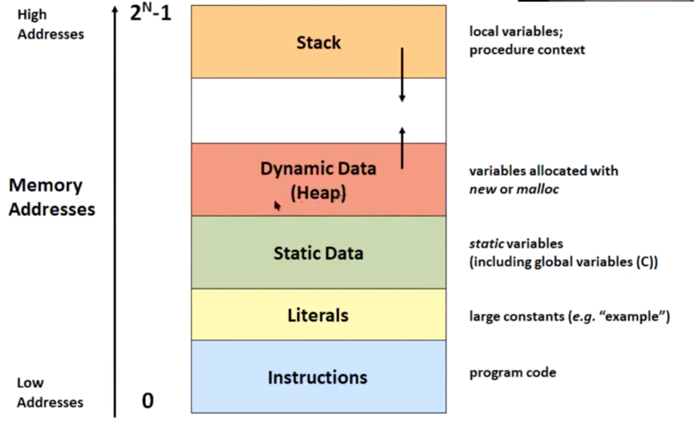

# Memory layout 

- Developer's written code goes into `Instruction` layer
- Large constants for example string does into `Literal` layer
- Static variable, including global variable goes into `Static Data`
- Variable allocated with `new` or `mlloc` goes into `Dynamic Data (Heap)`
- Local variable or procedure context goes into `Stack` layer
Following allocation to each data type
- Array
    - It depends on the type of allocation
    - If fixed size array i.e. at compile time then goes to stack layer
    - If variable size array at run time then it goes to `Heap`
    - 