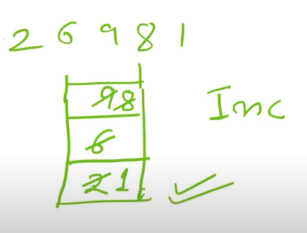
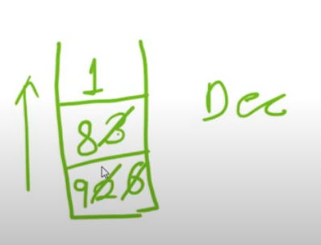

# Array
## Without using extra space
https://leetcode.com/problems/find-all-numbers-disappeared-in-an-array/

https://leetcode.com/problems/find-all-duplicates-in-an-array/
## Best time to buy and sell stocks
https://leetcode.com/problems/best-time-to-buy-and-sell-stock/

https://leetcode.com/problems/best-time-to-buy-and-sell-stock-II/

https://leetcode.com/problems/best-time-to-buy-and-sell-stock-III/

https://leetcode.com/problems/best-time-to-buy-and-sell-stock-IV/

https://leetcode.com/problems/best-time-to-buy-and-sell-stock-with-cooldown/

## Switch off bulb
https://leetcode.com/problems/bulb-switcher

https://leetcode.com/problems/bulb-switcher-ii

https://leetcode.com/problems/bulb-switcher-iii/

https://leetcode.com/problems/bulb-switcher-iv/


# Stack
## Get min
https://leetcode.com/problems/min-stack/
## Validate parentheses
https://leetcode.com/problems/valid-parentheses/

https://leetcode.com/problems/valid-parenthesis-string/

https://leetcode.com/problems/remove-outermost-parentheses/

## Generate parentheses
https://leetcode.com/problems/generate-parentheses/
https://leetcode.com/problems/longest-valid-parentheses/

## Expression evaluation
https://www.hackerrank.com/contests/code-maestros-14-04/challenges/baby-step

https://leetcode.com/problems/evaluate-reverse-polish-notation/

https://www.hackerrank.com/contests/cs1300-odd-2014/challenges/evaluate-expression

## Validate unix path
https://leetcode.com/problems/simplify-path/

## Visible sunset
https://leetcode.com/problems/max-increase-to-keep-city-skyline/

https://leetcode.com/problems/the-skyline-problem/

## Histogram Area
https://leetcode.com/problems/largest-rectangle-in-histogram/

https://leetcode.com/problems/maximal-rectangle/

https://www.youtube.com/watch?v=lsQTYlCiU6c

## Water trapping
https://leetcode.com/problems/trapping-rain-water/

https://leetcode.com/problems/trapping-rain-water-ii/

https://leetcode.com/problems/container-with-most-water/

https://www.youtube.com/watch?v=RV7jsfvJ33U

https://leetcode.com/problems/pour-water/
## Calculator
https://leetcode.com/problems/basic-calculator/

https://leetcode.com/problems/basic-calculator-ii/

https://leetcode.com/problems/basic-calculator-iii/

https://leetcode.com/problems/basic-calculator-iv/

https://leetcode.com/problems/build-binary-expression-tree-from-infix-expression/

## Remove duplicates
https://leetcode.com/problems/remove-duplicate-letters/

## Tag validator
https://leetcode.com/problems/tag-validator/

## Number of atoms
https://leetcode.com/problems/number-of-atoms/

## Maximum frequency stack
https://leetcode.com/problems/maximum-frequency-stack/

## Odd event jump
https://leetcode.com/problems/odd-even-jump/

## Number of valid sub array
https://leetcode.com/problems/number-of-valid-subarrays/

# Stack
https://leetcode.com/problems/next-greater-element-i/

https://leetcode.com/problems/remove-k-digits/


# Map
https://leetcode.com/problems/subarray-sum-equals-k/

https://leetcode.com/problems/subarray-product-less-than-k/

https://leetcode.com/problems/subarray-sums-divisible-by-k/

https://leetcode.com/problems/maximum-size-subarray-sum-equals-k/

https://leetcode.com/problems/max-points-on-a-line/solution/

https://leetcode.com/problems/substring-with-concatenation-of-all-words/

https://leetcode.com/problems/unique-email-addresses/

https://leetcode.com/problems/string-transforms-into-another-string/

# Monotonic stack
## Summary
- [2, 3, 9 , 1, 5]
- For every element  find the nearest element which is greater than element
- ans: [3, 5, -1, 5, -1]
- Brute force Approach:
    - Start traversing from left to right let's say i
    - Find element which is greater than current element i
- Approach using stack
    - Example: [2, 6, 9, 8, 1]
    - Monotonically increasing stack
        
    - Monotically decreasing stack
        
## Next smaller element
- Whenever need to find out next smaller element, we need increasing stack
- 
## Code template for increasing stack
```
const stack = [];
for (let i=0; i < A.length; i++) {
    while(stack.length > 0 && stack[stack.length - 1] > A[i]) {
        stack.pop()
    }
    stack.push(A[i])
}
```
## Problems
https://leetcode.com/problems/next-greater-element-i/

https://leetcode.com/problems/next-greater-element-ii/

https://leetcode.com/problems/next-greater-element-iii/


https://leetcode.com/problems/daily-temperatures/

https://leetcode.com/problems/shortest-unsorted-continuous-subarray/


https://leetcode.com/problems/online-stock-span/

https://leetcode.com/problems/132-pattern/

https://leetcode.com/problems/sum-of-subarray-minimums/

https://leetcode.com/problems/largest-rectangle-in-histogram/

https://leetcode.com/problems/odd-even-jump/

https://leetcode.com/problems/maximize-distance-to-closest-person/

## Reference
https://www.youtube.com/watch?v=m4hvxzLoN_I

https://www.youtube.com/watch?v=TunTV2-griM

https://www.youtube.com/watch?v=afecpxFVd5k